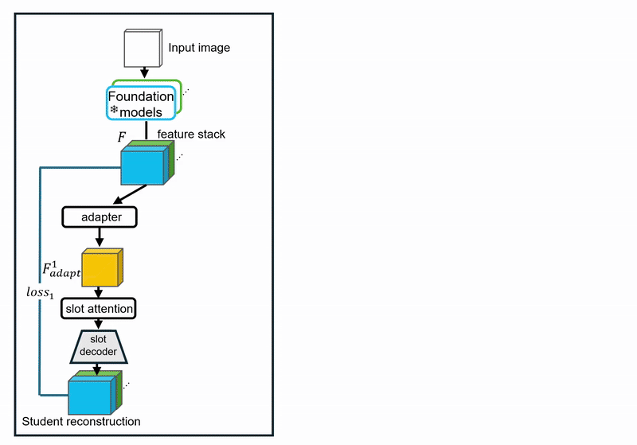

# [FORLA](https://forla-research.github.io/)

[**FORLA: Federated Object-centric Representation Learning with Slot Attention**](https://forla-research.github.io/)<br/>
[Guiqiu Liao](https://liaoguiqiu.github.io//),
[Matjaž Jogan](https://www.linkedin.com/in/matjazjogan),
[Eric Eaton](https://www.grasp.upenn.edu/people/eric-eaton/),
[Daniel Hashimoto](https://www.med.upenn.edu/apps/faculty/index.php/g275/p8205926)<br/>
_[NeurIPS'25](https://openreview.net/forum?id=WlVBCT5pbB) |
[GitHub](https://github.com/PCASOlab/FORLA) |
[arXiv](https://arxiv.org/abs/2506.02964) |
[Project page](https://forla-research.github.io/)_
 
<p align="center">
  
</p>


**Federated unsupervised feature adaptation**
<p align="left">
  
</p>
 

## Introduction

This is the official PyTorch implementation for paper: [FORLA: Federated Object-centric Representation Learning with Slot Attention]().
The code contains:

-   Unsupervised object-centric Slot attention (SA) model training with adaptation of a stack of foundation models (DINO,SAM,MAE,CLIP) 
-  The **FORLA** framework for Federated Object-centric learning
-   7 Realworld datasets (3 Surgical|4 Natural), establishing a large scale FL SA benchmark 
 

 
## Installation

Please refer to [install.md](docs/install.md) for step-by-step guidance on how to install the packages.

Clone the repo
```
git clone https://github.com/PCASOlab/FORLA.git
cd FORLA
```

## Dataset Preparation

Please refer to [data.md](docs/data.md) for dataset downloading and pre-processing.


## Training FL models
 
Option 1

1. use [FL_launcher.sh](./FL_launcher.sh) ([FL_launcher_w_env.sh](./FL_launcher_w_env.sh) if you are using virtual environment) to run server and clients all in once.
Config FL_launcher.sh to add more clients (here is a example with 4 clients):
```
#!/bin/bash

# Federated Learning Tmux Setup Script

# Create server session
tmux new-session -d -s server -n "FL Server"
tmux send-keys -t server "python -m main.FL.FL_server" C-m

# Create client sessions
tmux new-session -d -s client1 -n "FL Client1"
tmux send-keys -t client1 "python -m main.FL.FL_c1" C-m

tmux new-session -d -s client2 -n "FL Client2" 
tmux send-keys -t client2 "python -m main.FL.FL_c2" C-m

tmux new-session -d -s client3 -n "FL Client3"
tmux send-keys -t client3 "python -m main.FL.FL_c3" C-m

tmux new-session -d -s client4 -n "FL Client4"
tmux send-keys -t client4 "python -m main.FL.FL_c4" C-m

# Optional: Attach to server session by default
tmux attach-session -t server
```
2. Change this parameter in [main.FL.FL_server](./main/FL/FL_server.py) for aggreggating a specific number of local models (e.g., 4):
```
FED_MIN_CLIENTS = 4
```
3. For each client code, for instace client1[main.FL.FL_c1](./main/FL/FL_c1.py),
set the data keyword to ultilize training config of a given data:
```
import os
 
# os.environ['WORKING_DIR_IMPORT_MODE'] = 'train_miccai'  # Change this to your target mode
# os.environ['WORKING_DIR_IMPORT_MODE'] = 'eval_miccai'  # Change this to your target mode
 
# os.environ['WORKING_DIR_IMPORT_MODE'] = 'eval_pascal'  # Change this to your target mode
os.environ['WORKING_DIR_IMPORT_MODE'] = 'train_pascal'  # Change this to your target mode

```


```
4. sh FL_launcher.sh
```
See output like:
```
Not enough clients (0) for aggregation
Not enough clients (0) for aggregation
Not enough clients (0) for aggregation # no client is ready
Not enough clients (1) for aggregation # 1 clent is ready
Not enough clients (3) for aggregation # 3 clents are ready
Aggregated new global model v1
Aggregated new global model v2
Aggregated new global model v3
Aggregated new global model v4
.
.
```


---
Option 2

Start server & each clients within each python commander individually:

1. Follow option 1 to setup key parameters for server and clients.

2. Decompose FL_launcher.sh mannually to different command window:
Use one window for server:
```
conda activate forla # optional if you use conda env
python -m main.FL.FL_server
```
Then use other multiple windows for clients:
```
conda activate forla # optional if you use conda env
python -m main.FL.FL_c[client_index]
```


---

## Evaluation FL models
 
1.  For each client code, for instace client1[main.FL.FL_c1](./main/FL/FL_c1.py),
set the keyword to ultilize evaluation config of a specific data:
```
import os
 
# os.environ['WORKING_DIR_IMPORT_MODE'] = 'train_miccai'  # Change this to your target mode
# os.environ['WORKING_DIR_IMPORT_MODE'] = 'eval_miccai'  # Change this to your target mode
 
os.environ['WORKING_DIR_IMPORT_MODE'] = 'eval_pascal'  # Change this to your target mode
# os.environ['WORKING_DIR_IMPORT_MODE'] = 'train_pascal'  # Change this to your target mode

```
2 run [FL_launcher_eval.sh](./FL_launcher_eval.sh) 
```
tmux kill-server # if had other sessions running 
sh FL_launcher_eval.sh
```

---
## FL pretrained models 

If you want to directly use pretrained models, they can be downloaded here:
[7-domain FL model](https://upenn.box.com/s/lpts8x6e66fga5litsvgxznj1y2ym30x)


## Cite

```
@article{liao2025forla,
  title   = {FORLA: Federated Object-centric Representation Learning with Slot Attention},
  author  = {Liao, Guiqiu and Jogan, Matja&#382; and Eaton, Eric and Hashimoto, Daniel A.},
  journal={NeurIPS},
  year={2023}
}
```
## License

FORLA is released under the PENN ACADEMIC SOFTWARE LICENSE. See the LICENSE file for more details.

## Contact

If you have any questions about the code, please contact Guiqiu Liao liaoguiqiu@outlook.com
